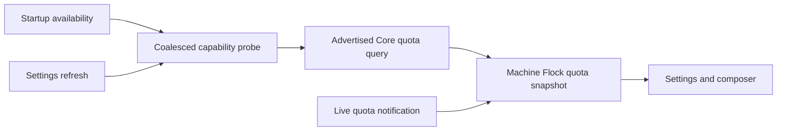

# Refresh subscription quota through the existing capability probe

Status: proposed
Translation: pending

## Abstract

Startup and Settings already probe ACP capabilities, but the temporary probe discards
quota notifications and never invokes the Core quota query. Reusing that process supplies
quota before a prompt while avoiding another transport or background polling loop.
The proposed change writes results through the existing machine quota partition and makes
stale values explicit. A short query deadline favors usable capabilities over waiting for
quota, and provider/account partitioning retains the current storage contract.

## Responsibilities and decisions

An independent query process would duplicate launch/authentication and cancellation handling.
The existing probe already owns these concerns and can query before cleanup. The optional
five-second deadline bounds added manual-refresh latency; provider failures preserve the
capability result. Notification-only adapters retain their startup snapshot fallback.

The writer serializes live and queried snapshots. A query carries its attempt start time,
so a slow result cannot replace a live update accepted after that attempt began. Missing
entries in a replacement snapshot keep their last values with stale metadata. Clearing them
or inferring a zero at reset would destroy useful evidence or misrepresent remaining quota.
The renderer also checks reset expiry, including legacy rows without cache metadata.

The [behavior Spec](../../../../specs/subscription-quota-refresh.md) is a draft. This proposal
adds no cloud billing dependency, prompts, continuous polling, or automatic model selection.
It adds optional machine cache metadata without changing the Core wire contract.

## Evidence and verification

The existing capability and MachineDocument suites exercise query/notification results,
provider failure, deterministic timeout/cancellation, ordered writes and failure recovery.
Renderer suites exercise stale percentages and missing-quota displays. The startup runtime
suite covers a later availability transition. The evidence is synthetic and local;
provider-side production behavior remains an integration boundary for review.
