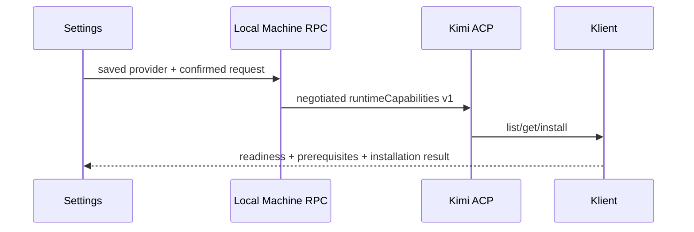

# Runtime-owned capability setup from provider settings

Status: proposed
Translation: current

[中文](2026-10-11-runtime-capability-installation.zh.md)

## Abstract

Kimi already exposes Computer Use and WebBridge installation and prerequisite detection, but Lody cannot invoke them through ACP. The proposed local desktop slice forwards a versioned, explicitly confirmed request from saved provider settings to that runtime service. Installation stays runtime-owned and readiness is displayed independently from downloads and permissions. The shared contract still needs a published Core version and a rebuilt managed Kimi artifact; source checks do not prove a shipped feature or human approval.

Work stopped after the issue author explicitly offered to be assigned and implement these slices. This branch preserves unfinished reference code only; it is not offered as a competing contribution. Component typechecking found an unresolved direct Core import and resulting implicit-any diagnostics. No upstream PR or comment was created.

## Decision and evidence

[Issue #798](https://github.com/LodyAI/Lody/issues/798) requests browse/install/status with capability gating, explicit confirmation and prerequisite guidance. The Klient `global.capabilities` facade already exposes list/get/install and native statuses. Directly writing the runtime home would duplicate native installation/migration logic and violate the requested ownership boundary. The client preserves the runtime process until its asynchronous install reports completion instead of killing it after the initial response.

The [draft Spec](../../../../specs/runtime-capability-installation.md) records the consent/ownership decision needing human review. Root rules require Specs to be human-reviewed for approval, but do not require approval before reference code is written. This note and the Spec remain proposed/draft. Remote transport and streaming progress are deferred; the slice is not a claim to close the complete issue.

## Validation and delivery limits

Core build/typecheck and its behavioral response validation suite are executed against the changed source. Kimi source validation uses an ignored local dependency link to that Core source; its pinned registry dependency cannot yet supply the new contract. Production delivery requires a real published Core version, updated Kimi dependency/lockfile, a separately built checksummed managed runtime and corresponding root artifact revision. No capability was downloaded/installed on the user's machine, and no OS permissions or browser connection were exercised. A fork PR also requires the user's actual public Context handoff choice under `.github/AGENTS.md`; this note does not invent that answer.
