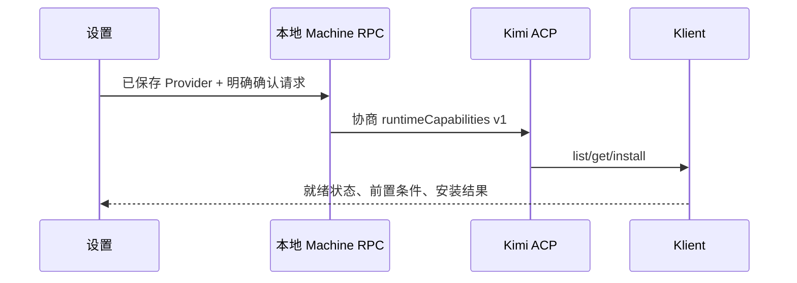

# 从 Provider 设置安装运行时能力

Status: proposed
Translation: current

[English](2026-10-11-runtime-capability-installation.md)

## 摘要

Kimi 已提供 Computer Use 和 WebBridge 的安装与前置条件探测，但 Lody 无法通过 ACP 调用。本地桌面方案将已保存 Provider 设置中的版本化、明确确认请求转发给原生服务。安装仍由运行时拥有，就绪状态与下载、权限分开显示。共享合同仍需真实发布 Core 版本并重建 managed Kimi artifact；源码检查不证明功能已上线或已获人工批准。

作者明确提出希望被分配并亲自实现这些阶段，因此工作已停止。本分支仅保存未完成参考代码，不作为竞争贡献提交。组件类型检查发现直接 Core import 无法解析及其后续 implicit-any 错误。未创建上游 PR 或评论。

## 决策与证据

[Issue #798](https://github.com/LodyAI/Lody/issues/798) 要求浏览、安装、状态、能力声明门槛、明确确认和前置条件引导。Klient 的 `global.capabilities` 已提供 list/get/install 及原生状态。直接写运行时目录会重复原生安装、迁移逻辑，违背职责边界。客户端在异步安装报告结束前保留运行时进程，而不在初始响应后杀进程。

[Spec 草案](../../../../specs/runtime-capability-installation.zh.md) 记录需人工审核的确认与职责决策。根规则要求人工审核后才能 approved，并未要求写参考代码前批准。本 note 保持 proposed，Spec 保持 draft。远程传输与流式进度暂未覆盖，本阶段不声称关闭整个 issue。

## 验证与交付限制

Core build/typecheck 和响应验证行为测试基于变更源码执行。Kimi 源码验证通过 ignored 本地依赖链接使用该 Core 源码，当前 registry 精确依赖尚不包含新合同。生产交付仍需真实发布 Core 版本、更新 Kimi 依赖和锁文件、独立构建带校验和的 managed runtime，并更新根 artifact revision。未在用户机器下载或安装能力，未验证系统权限或浏览器连接。fork PR 还需要用户按 `.github/AGENTS.md` 实际选择公开 Context handoff；本 note 不编造答复。
