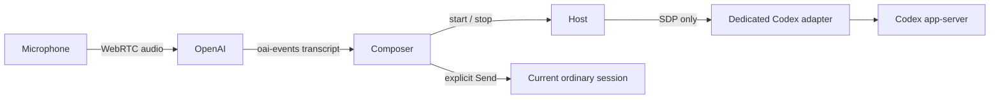

# Codex realtime dictation

Status: draft
Translation: current

[中文](codex-realtime-dictation.zh.md)

A desktop user can opt into experimental dictation using an existing Codex
ChatGPT login. Speech produces an editable composer draft. It never sends a
message or starts a turn on the destination coding session without the user's
normal Send action.

## Responsibilities

The renderer owns microphone permission, WebRTC, transcript presentation, and
capture cleanup. The daemon negotiates an isolated short-lived voice thread
through the selected Codex configuration; it must not expose credentials or
reuse the active coding thread for voice control. The adapter owns native
experimental protocol negotiation. Shared extension contracts belong in ACP
Core, with explicitly advertised support; unsupported adapters expose no voice
control. This does not require the destination session to use Codex.

Before capture, the user sees that audio goes directly to OpenAI and chooses to
start. The feature is off by default. Audio, SDP, and temporary transcription
state are not persisted as conversation history or telemetry. The draft follows
the ordinary composer persistence behavior; only Send creates a user entry.

## Capture lifetime

The composer distinguishes connecting from listening. It requests no microphone
track until explicit Start and sends no track until signaling and the data
channel are ready. There is no promise that early speech is buffered: the issue
reports roughly three seconds of lost input during connection. Cancellation,
permission denial, signaling failure, channel closure, navigation, and window
closure stop every track, close the peer connection, and release the native
voice thread/process. Errors preserve the user's existing typed draft.

Dictation does not attach or play remote audio. It cannot change the destination
session, send the draft, respond to a realtime handoff, or interrupt a coding
turn. Transcript events from a cancelled or replaced capture cannot edit the
current draft. User edits made during capture must not be overwritten by a
late transcript event; the exact insertion policy needs implementation and
behavioral verification before shipping.

## Native compatibility and limits

Issue #1263 reports successful bundled Codex 0.159.2, ChatGPT login, WebRTC v3.
It reports that text-only output is v2-only and subscription WebRTC has no pure
transcription mode. A silent prompt plus muted remote audio therefore remains a
realtime model interaction, not a guaranteed transcription-only service.

The experimental request and data-channel schema must be verified against the
pinned runtime. Do not infer compatibility from generated notification types,
use deprecated events, change account credentials, or silently fall back to a
separate API key or a paid transcription provider. macOS capture requires the
usage description and audio-input entitlement. Optional spoken replies and
conversation handoffs are outside this first slice.

## Evidence and validation

- [Feature request #1263](https://github.com/LodyAI/Lody/issues/1263): author-reported experiment; not independently reproduced here.
- [Codex app-server protocol](https://github.com/openai/codex/tree/main/codex-rs/app-server): experimental native interface.
- Inspected Lody adapter has native JSON-RPC/authentication and generated realtime notifications, but no realtime start client method or host/composer capability.
- This draft describes proposed behavior. No microphone, native realtime, or desktop UX validation has been completed.

## Pinned schema validation

Ran bundled Codex 0.159.2 `app-server generate-json-schema --experimental`
with an empty isolated CODEX_HOME, without login, microphone, or model requests.
The schema confirms required `threadId` and `outputModality`, v3, WebRTC SDP,
`prompt`, `includeStartupContext: false`, and `clientManagedHandoffs`. The start
response is empty; SDP answers arrive as separate notifications. This validates
shape only, not account access or event behavior. The voice thread must also
isolate its working directory, omit startup context, and deny any tool/coding
execution, even if a native realtime handoff creates a voice-thread turn;
a silent prompt or clientManagedHandoffs is not an enforced boundary
against the model starting execution.
