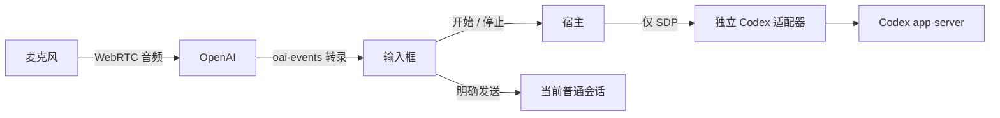

# Codex 实时听写

Status: draft
Translation: current

[English](codex-realtime-dictation.md)

桌面用户可以主动开启实验性听写，使用已有的 Codex ChatGPT 登录。
语音进入输入框，用户编辑后按正常的发送按钮才会提交；听写不能自行发消息或启动代码执行。

## 职责

渲染器负责麦克风权限、WebRTC、转录展示和资源清理。守护进程通过选定的 Codex 配置，
协商独立且短暂的语音线程，不暴露凭据，不把语音控制加到正在执行代码的线程。
适配器负责实验性原生协议。共享扩展契约归 ACP Core 所有，并明确声明支持情况；
不支持的适配器不展示语音控制。消息的目标会话不必使用 Codex。

功能默认关闭，开始录音前说明音频直接发送给 OpenAI，由用户主动开始。
音频、SDP 和临时转录状态不进入会话历史或遥测。草稿遵循原有输入框持久化行为，
只有发送才创建用户消息。

## 采集生命周期

输入框区分连接中和正在聆听。明确开始后才申请麦克风轨道，信令和数据通道就绪前不发送轨道。
不承诺缓存早期语音：issue 报告连接时约三秒的输入会丢失。取消、权限拒绝、信令失败、
通道关闭、页面切换和窗口关闭都要停止所有轨道、关闭连接，并释放原生语音线程及进程。
错误不能清除已有的文字草稿。

听写不挂载或播放远端音频，不改变目标会话，不发送草稿，不处理实时模型的 handoff，
不打断代码执行。已取消或被替换的采集事件不能改当前草稿。采集中用户编辑的文字不能被迟到的
转录覆盖；具体插入策略需要在交付前实现并做行为验证。

## 原生兼容性与限制

#1263 作者报告，内置 Codex 0.159.2 配合 ChatGPT 登录和 WebRTC v3 已实验成功。
纯文字输出仅支持 v2，订阅登录的 WebRTC 没有纯转录模式。因此静默 prompt 加不播放远端音频，
仍然是实时模型交互，不能保证它只是转录服务。

必须对固定版本核实实验请求和数据通道结构，不能从通知类型推断完整兼容性，不能使用弃用事件、
改变登录凭据，或静默回退到额外 API key 或付费转录服务。macOS 还需麦克风用途说明和
音频输入 entitlement。语音答复和会话 handoff 不属于第一阶段。

## 证据和验证

- [Feature request #1263](https://github.com/LodyAI/Lody/issues/1263)：作者报告的实验，本次没有独立复现。
- [Codex app-server 协议](https://github.com/openai/codex/tree/main/codex-rs/app-server)：实验性原生接口。
- 已检查 Lody 适配器具备原生 JSON-RPC、登录和实时通知类型，但没有实时启动客户端方法或宿主/输入框能力。
- 本文为行为提案，尚未验证麦克风、原生实时协议或桌面体验。
