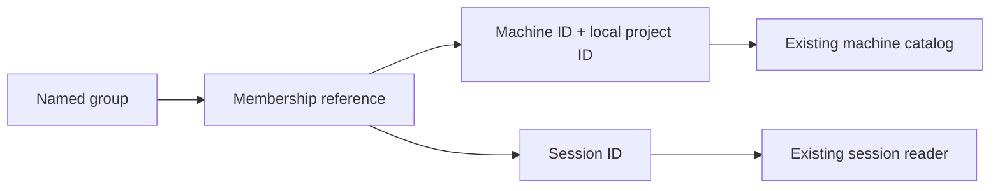

# Project groups

Status: draft
Translation: current

[中文](project-groups.zh.md)

## Scenario and scope

A developer follows one feature across local projects on different machines and
unbound conversations. A named group provides a common navigation entry without
changing where any project or conversation executes. This proposal addresses
[Issue #1144](https://github.com/LodyAI/Lody/issues/1144); it is not shipped behavior.

## Responsibilities

A group owns its name and membership references only. A local-project reference
contains both machine ID and local-project ID; matching paths or names on two
machines never establish identity. A conversation reference uses its existing
session ID. Adding or removing membership leaves the underlying objects intact.

The existing machine catalog owns project paths. Session metadata and execution
services continue to own target machines, permissions, history and synchronization.
Groups do not authorize access, move files, migrate sessions or start execution.
A member unavailable to the current reader remains in the group; unavailable
must not imply deleted or grant permission. Display must respect existing access
checks before exposing any referenced object's metadata.

## Bounded first slice and open decisions

The reference implementation provides identity, idempotent add/remove and a
resolution projection retaining unavailable members. It introduces no stored
schema, migration, protocol, UI, CLI command or new synchronization channel.
It deliberately does not export a product API until the owning consumer exists.

A later integrated slice should use the existing workspace Flock document for
organization metadata, with independent membership rows rather than replacing a
whole list during concurrent edits. Maintainers still need to choose whether
sessions can belong to several groups, explicit dangling-member removal behavior,
and membership visibility for readers lacking access. Those decisions precede
persistence/UI implementation; this draft does not assert human approval.

## Evidence and validation

- Current machine/project ownership: `packages/shared/src/machine-flock.ts`,
  `packages/shared/src/project.ts`, `packages/shared/src/schema.ts`.
- Existing workspace catalog: `packages/shared/src/workspace-flock.ts`.
- Reference implementation: `packages/shared/src/project-group.ts`.
- Deterministic behavior tests: `packages/shared/tests/project-group.test.ts`.
- End-to-end grouping and offline-machine UI behavior are not implemented or tested.
