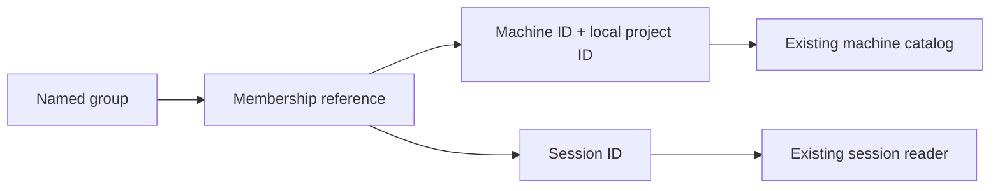

# Project groups

Status: draft
Translation: current

[中文](project-groups.zh.md)

## Scenario and scope

A developer follows one feature across local projects on different machines and
unbound conversations. A named group provides a common navigation entry without
changing where any project or conversation executes. This proposal addresses
[Issue #1144](https://github.com/LodyAI/Lody/issues/1144); it is not shipped behavior.

## Responsibilities

A group owns its name and membership references only. A local-project reference
contains both machine ID and local-project ID; matching paths or names on two
machines never establish identity. A conversation reference uses its existing
session ID. Adding or removing membership leaves the underlying objects intact.

The existing machine catalog owns project paths. Session metadata and execution
services continue to own target machines, permissions, history and synchronization.
Groups do not authorize access, move files, migrate sessions or start execution.
A member unavailable to the current reader remains in the group; unavailable
must not imply deleted or grant permission. Display must respect existing access
checks before exposing any referenced object's metadata.

## Bounded first slice and open decisions

The first storage slice provides identity, idempotent add/remove and a resolution
projection retaining unavailable members. In the existing workspace Flock document,
`projectGroup` rows contain versioned ID/name metadata; independent
`projectGroupMember` rows contain machine-qualified project or session references.
An exported Repo-facing operation flushes local durability before optional upload;
upload failure preserves the local mutation and reports `synced: false`.

A group is workspace-readable organization metadata, not private storage. Callers
must check existing access before resolving or displaying member metadata. They
create fresh group IDs, never reuse a deleted group's ID, and explicitly remove
dangling members. Several-group membership is allowed; membership changes do not
move sessions between projects. This is separate from workdir migration in #1064,
project display/identity in #1048 and collapsed-project badges in #137.

No UI navigation, CLI command, unread rollup or new synchronization channel is
implemented. The existing MCP/Role row parser remains separate from group parsing;
clients opt into the group store instead of treating group rows as catalog entries.
The draft records these proposed semantics without asserting human approval.

## Evidence and validation

- Current machine/project ownership: `packages/shared/src/machine-flock.ts`,
  `packages/shared/src/project.ts`, `packages/shared/src/schema.ts`.
- Existing workspace catalog: `packages/shared/src/workspace-flock.ts`.
- Model/storage call boundary: `packages/shared/src/project-group.ts`,
  `packages/shared/src/project-group-store.ts`.
- Deterministic behavior tests: `packages/shared/tests/project-group.test.ts`.
- End-to-end grouping and offline-machine UI behavior are not implemented or tested.
