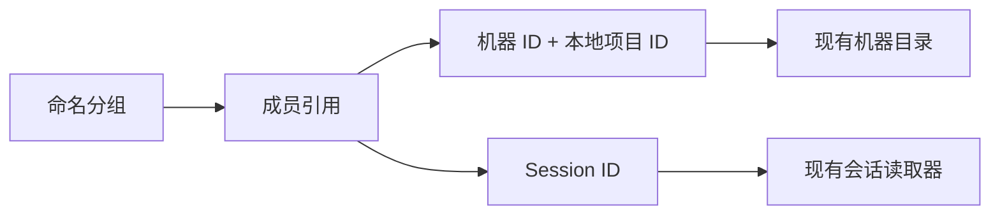

# 项目分组

Status: draft
Translation: current

[English](project-groups.md)

## 场景与范围

开发者需要把不同机器上的本地项目与未绑定项目的会话放在同一个功能入口下。
命名分组提供导航组织，不改变项目和会话在哪里执行。本提案针对
[Issue #1144](https://github.com/LodyAI/Lody/issues/1144)，不是已上线行为。

## 职责

分组只拥有名称和成员引用。本地项目引用同时包含机器 ID 和本地项目 ID；
不同机器上的相同路径或名称不能建立身份关联。会话引用使用现有 session ID。
添加或移除成员不会修改底层对象。

现有机器目录继续拥有项目路径。会话元数据和执行服务继续拥有目标机器、权限、
历史及同步职责。分组不授权访问、不移动文件、不迁移会话，也不启动执行。
当前读取者无法解析的成员仍留在分组里；不可用不代表已删除，也不授予权限。
展示成员元数据前必须遵守现有访问检查。

## 最小切片与开放决定

参考实现提供身份标识、幂等添加与移除，以及保留不可用成员的解析投影。
它不新增持久化格式、迁移、协议、界面、CLI 命令或同步通道。
在有实际消费者前，不导出产品 API。

后续集成切片可通过现有 workspace Flock 文档存放组织元数据，使用独立成员行，
避免并发编辑时替换整个列表。维护者仍需决定会话能否属于多个分组、悬空成员的
显式清理行为，以及无访问权限的读取者可见哪些成员。这些决定先于持久化和界面
实现；此草案不声称已获得人工批准。

## 证据与验证

- 当前机器与项目归属：`packages/shared/src/machine-flock.ts`、
  `packages/shared/src/project.ts`、`packages/shared/src/schema.ts`。
- 现有工作区目录：`packages/shared/src/workspace-flock.ts`。
- 参考实现：`packages/shared/src/project-group.ts`。
- 确定性行为测试：`packages/shared/tests/project-group.test.ts`。
- 端到端分组与离线机器界面行为尚未实现或验证。
