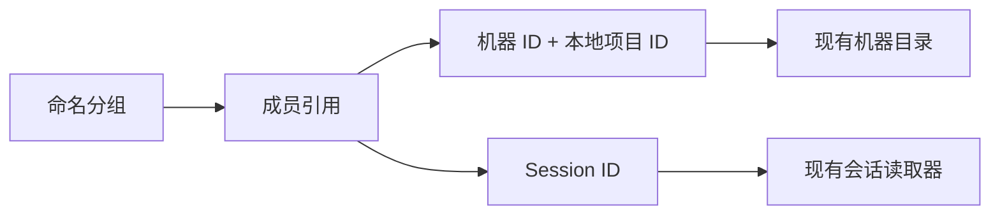

# 项目分组

Status: draft
Translation: current

[English](project-groups.md)

## 场景与范围

开发者需要把不同机器上的本地项目与未绑定项目的会话放在同一个功能入口下。
命名分组提供导航组织，不改变项目和会话在哪里执行。本提案针对
[Issue #1144](https://github.com/LodyAI/Lody/issues/1144)，不是已上线行为。

## 职责

分组只拥有名称和成员引用。本地项目引用同时包含机器 ID 和本地项目 ID；
不同机器上的相同路径或名称不能建立身份关联。会话引用使用现有 session ID。
添加或移除成员不会修改底层对象。

现有机器目录继续拥有项目路径。会话元数据和执行服务继续拥有目标机器、权限、
历史及同步职责。分组不授权访问、不移动文件、不迁移会话，也不启动执行。
当前读取者无法解析的成员仍留在分组里；不可用不代表已删除，也不授予权限。
展示成员元数据前必须遵守现有访问检查。

## 首次存储实现与开放决策

首步实现提供成员标识、幂等增删和保留不可用成员的解析视图。既有 workspace
Flock 文档的 `projectGroup` 行保存版本化 ID/名称；独立 `projectGroupMember` 行保存
包含机器标识的本地项目引用或会话引用。导出的 Repo 调用先 flush 本地持久化，
再尝试可选上传；上传失败保留本地修改并返回 `synced: false`。

分组是工作区可读的组织元数据，不是私密存储。调用方展示成员元数据前必须检查既有访问权限，
创建全新的组 ID，不重用已删除组的 ID，并显式移除失效成员。允许一个成员加入多个分组；
成员关系变更不把会话搬到其他项目。这与 #1064 的工作目录迁移、#1048 的项目名称/身份
以及 #137 的折叠项目未读标记分开。

尚未实现 UI 导航、CLI 命令、未读汇总或新同步通道。既有 MCP/Role 行解析保持独立；
客户端选择使用分组存储，而不把分组行当作目录条目。本草案不声称上述语义已获人类批准。

## 证据与验证

- 当前机器与项目归属：`packages/shared/src/machine-flock.ts`、
  `packages/shared/src/project.ts`、`packages/shared/src/schema.ts`。
- 现有工作区目录：`packages/shared/src/workspace-flock.ts`。
- 参考实现：`packages/shared/src/project-group.ts`、`packages/shared/src/project-group-store.ts`。
- 确定性行为测试：`packages/shared/tests/project-group.test.ts`。
- 端到端分组与离线机器界面行为尚未实现或验证。
