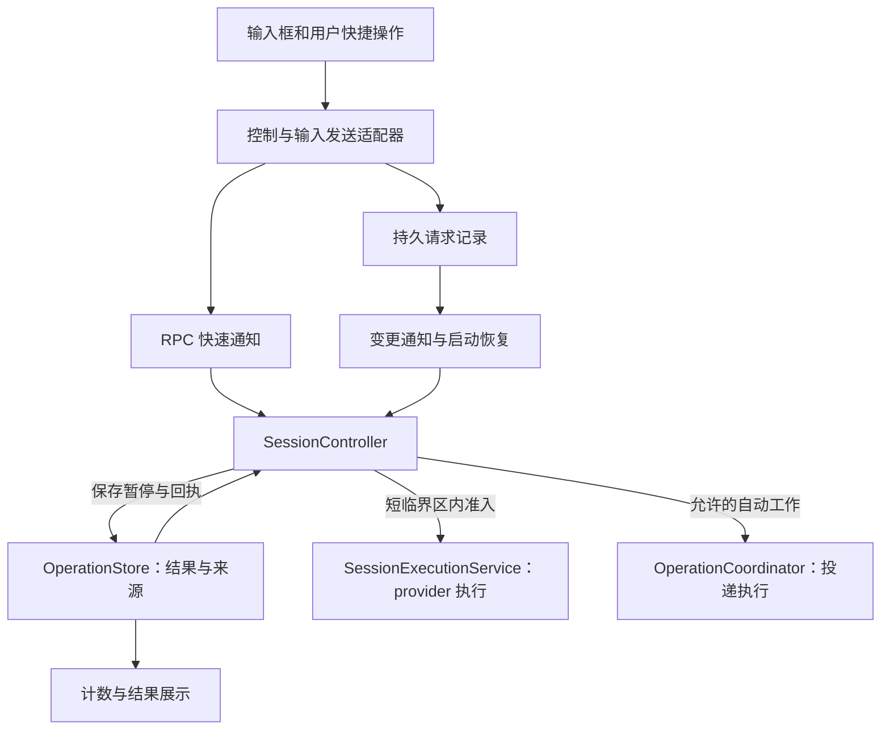

# 会话停止、取消与结果投递：统一控制设计

Status: draft
Translation: pending

## 场景与结论

用户按 Stop 后，希望获得一个安静的输入机会；后台操作可以继续结束、保存结果，但不能接连启动回复。下一条用户消息可以携带结果，包括已经排队的消息。新消息发起的新工作可以正常续聊。

建议在现有执行与编排模块之间收敛出一个 `SessionController`，统一处理控制意图、执行准入和完成确认。保留现有 provider 执行、操作结果存储与运行端租约，不引入新调度框架或停止编号。这是待审查的局部架构方案，尚未实现；不代表 PR #517 已解决最新两条 P1。

## 1. 实际问题与设计目标

当前问题不是单纯少了几个判断，而是不同模块各自拥有一部分“控制权”：

| 当前职责分散点                              | 后果                                       | 本方案归属                                      |
| ------------------------------------------- | ------------------------------------------ | ----------------------------------------------- |
| UI、RPC 接收端、元数据 watcher 分别解释取消 | 旧客户端省略字段，被新接收端升级成 Stop    | 协议适配器明确解码，Controller 只接收确定的意图 |
| watcher 先标记 seen，再调用取消             | 持久暂停失败后，同一请求不再重试           | Controller 维护命令处理状态；watcher 只唤醒     |
| 取消服务自己清理共享元数据                  | 取消一个回合可能清掉尚未持久完成的控制请求 | 只有控制请求的确切终态允许确认该请求            |
| coordinator、执行服务分别检查能否启动       | A 结束/B 接替与 Stop 交错容易漏拦截        | 一个会话内的停止与启动准入共用短临界区          |
| 输入框、快捷操作、后台重试分别组装结果策略  | 看起来相同的用户操作产生不同效果           | 所有用户输入走同一提交入口；自动事件走独立入口  |

最新第二条评论需要限定结论：当前 coordinator 在暂停写失败时保留了进程内 `blockedSessions`，所以不能直接断言同一进程马上继续投递。能确认的问题是 watcher 提前去重且忽略失败，持久暂停没有完成重试；进程内门禁也不能代替重启后的保证。

## 2. 行为规则

| 编号 | 可验收规则                                                                                                         |
| ---- | ------------------------------------------------------------------------------------------------------------------ |
| R1   | `cancel_turn` 只取消精确目标回合。内部清理、打断并发送、旧格式取消请求都不能隐含暂停结果投递。                     |
| R2   | 显式 `stop_session` 获准后，阻止旧工作产生新的自动回复；结果继续保存，目标子任务不随 requester 自动取消。          |
| R3   | Stop 可以追随没有新用户输入介入的自动接替回复；不能取消新用户回合，也不能阻挡该新回合的工作。                      |
| R4   | 只有暂停状态已经持久提交，才可确认“自动续聊已暂停”。取消当前回复成功不等于暂停成功。                               |
| R5   | 暂停写入失败时，保留待处理请求、临时阻止本会话新的 provider 提交并主动重试；启动恢复先重建这些门禁，再运行投递器。 |
| R6   | 下一条实际提交的用户输入，按携带选择一次合并当前已就绪结果。消息何时入队不影响资格；用户快捷操作和普通输入一致。   |
| R7   | 已开始提交且结果未知的输入不能自动重放。保留原始结果和不确定状态，不把“发起了调用”冒充“处理完成”。                 |
| R8   | 成功处理新用户输入不会解除旧工作的暂停；新输入发起的新工作拥有自己的自动续聊资格。                                 |
| R9   | RPC 与持久通知重复、乱序或确认丢失，不能扩大控制请求的范围，也不能让同一结果多次自动启动。                         |
| R10  | 结果展示、结果携带、自动唤醒分别记账；展示成功或回复正常结束都不能清空待处理结果。                                 |

这里“用户输入”包括发送、显式 steer、实现计划、创建 PR、修复 CI。后台容量重试和操作完成通知不算新的用户指令。自动重试复用原输入快照，不临时吸收新完成结果。

### 明确采用的取舍

- 不引入停止次数、停止版本号，客户端不传额外的顺序编号。
- Stop 不删除已有用户消息队列。暂停完成后，它们可以继续提交并携带结果。
- Stop 持久化仍在失败重试时，新输入可以编辑并持久排队，但暂不提交 provider。这防止尚未完成的 Stop 重试误暂停后来已经启动的新工作。
- 旧客户端的取消含义保持不变。完整 Stop 能力需要新客户端与新运行端配合，不能靠省略字段猜测。
- 成功携带后再被取消的回复不自动重新携带同一快照；结果仍可查看和由用户明确再次提供。该选择优先避免重复执行，不能保证 AI 已阅读或完成处理。

## 3. 术语与状态

| 概念           | 含义                                                                                              |
| -------------- | ------------------------------------------------------------------------------------------------- |
| User Turn      | 现有用户消息 id，包括从队列提升或 steer 接受的输入。                                              |
| 工作来源 / Run | 一条已准入 User Turn 及它产生的自动续聊、委派操作；使用既有 User Turn id 作为来源，不产生新编号。 |
| 控制请求       | 确定意图、会话、目标 Assistant Turn 及经过认证的发起者。                                          |
| 待处理控制记录 | 发送端已持久保存、尚未收到确切终态的请求。                                                        |
| 控制回执       | 运行端关于该确切请求的终态；不等同于 UI 收到 RPC 响应。                                           |
| 结果收件箱     | 已完成操作及其携带状态；保留现有 operation/delivery 存储作为事实来源。                            |
| 执行准入       | 决定一次 provider 提交能否开始的短临界区；不持锁等待整段模型回复。                                |

控制状态不是一个永久封死会话的 `paused` 布尔值：

```text
会话控制：ready → stop_pending → ready
                          └─ 写入失败：留在 stop_pending，重试

旧工作自动策略：allowed → held（新用户输入不会改回 allowed）
新工作自动策略：新 User Turn 准入时建立 allowed

结果携带：ready → started → consumed
                     └─ 失联/崩溃无法确认 → uncertain
          已明确未提交 → ready
```

`stop_pending` 是存储操作尚未确认的临时状态。持久暂停成功后，会话允许新的用户输入；被暂停的是旧工作来源，不是整个会话永远不能再运行。

## 4. 模块职责



- **发送适配器**：UI 明确调用 `cancelTurn`、`stopSession` 或 `submitHumanInput`。统一冻结用户选择，验证目标能力，持久保存控制请求，然后发送 RPC 通知。不能把“快捷按钮”默认归为自动动作。
- **协议适配器**：只做鉴权、形状验证、兼容转换。旧取消统一转换成 `cancel_turn`；不调用暂停存储，也不决定请求完成。
- **SessionController**：该会话唯一控制所有者。解释目标及来源、建立准入门禁、提交暂停与回执、安排重试、认领输入快照。复用现有 Host lease 和 Worker 身份，不允许 UI、MCP 子进程另起一个控制器。
- **SessionExecutionService**：接收准入后的执行请求，执行精确回合取消、provider 调用及回合结算。失去自行清除控制请求、解释 Stop 的职责。
- **OperationCoordinator**：继续负责扫描、完成检测、进度展示和投递尝试；每次启动经过 Controller，不能直接绕过准入调用 provider。
- **OperationStore**：保存工作来源的自动策略、结果、认领与回执；将必须一致的数据放在同一 SQLite 事务。展示计数不是执行权来源。
- **Watcher**：通知“有工作待检查”。只可缓存已确认终态，不能凭调用发生过就把请求认定为完成，也不拥有单独的业务重试策略。

## 5. 协议与兼容性

建议新增能力 `sessionControl: 1` 和显式控制命令，不再扩展 `turnOnly !== true` 的反向含义。

```ts
type SessionControlCommand =
  | { kind: 'cancel_turn'; sessionId: string; targetTurnId: string }
  | { kind: 'stop_session'; sessionId: string; targetTurnId: string };

type SessionControlResult =
  | { status: 'pending'; reason: 'persisting' | 'retrying' | 'cancelling' }
  | { status: 'applied'; effect: 'turn_cancelled' | 'automatic_replies_held' }
  | { status: 'obsolete'; reason: 'new_human_turn' | 'target_already_inactive' }
  | { status: 'rejected'; reason: 'unsupported' | 'not_authorized' | 'invalid_target' };
```

鉴权身份由传输上下文及现有访问检查提供，不信任客户端任意声明的 userId。对象省略的是示意中的传输认证字段，不是取消鉴权。

| 发送端 → 接收端                                            | 实际行为                                                                               |
| ---------------------------------------------------------- | -------------------------------------------------------------------------------------- |
| 旧 → 新：旧 `session/cancel`、旧 `lastCanceledTurn` 字符串 | 始终精确取消当前目标，不暂停操作投递。                                                 |
| 新 → 新：显式 Stop                                         | 新协议 `stop_session`，RPC 和持久记录使用同一个命令。                                  |
| 新 → 新：内部取消                                          | `cancel_turn`，两个传递路径保持一致。                                                  |
| 新 → 旧：用户 Stop                                         | 可以执行旧的精确取消，但明确显示运行端不支持暂停后续自动回复；不能返回完整 Stop 成功。 |
| 新 → 旧：内部取消                                          | 使用旧取消协议，保留原行为。                                                           |

新控制命令使用新的持久命名空间，不继续改变 `lastCanceledTurn` 的类型与默认含义。旧 watcher 不会误执行它。已有 PR 中的对象取消格式可以只读兼容为 turn-only；旧字符串中无法恢复用户当时的意图，不能静默迁移成 Stop。

同一次请求的逻辑键为 `(sessionId, kind, targetTurnId)`，复用已有目标 id；RPC 与持久通知都引用它。`cancel_turn(A)` 与 `stop_session(A)` 不会互相去重。这是幂等身份，不是停止编号，也不用于比较消息先后。重复命令若内容或身份冲突，必须拒绝，不能覆盖已有回执。

## 6. Stop 的完整处理顺序

```text
发送端：本地持久保存 stop_session(A) → 发送 RPC 通知 → 等待确切回执

运行端：
  验证身份与目标能力
  在会话短临界区内核对 A 与当前工作来源
    已有新用户回合 → obsolete，不改新工作的策略
    当前为 A / A 后的自动回复 / 同一工作已暂时空闲 → 接受 Stop
  先建立 stop_pending 准入门禁
  立即请求取消当前匹配的回复（不等待 provider 结束才暂停）
  同一 SQLite 事务：
    暂停当前已登记的旧工作来源及其结果自动投递
    写入该控制请求的持久回执
  提交成功 → 移除临时门禁，允许新的用户输入；旧来源仍 held
  提交失败 → 保留待处理请求和门禁，由 Controller 主动重试
```

暂停成功与 provider 取消确认分别呈现。provider 不响应取消时，旧自动工作仍不能接替；不能让 UI 因暂停写成功就错误显示 provider 已停止。

### 判断自动接替，不能只看 depth

Controller 维护当前执行所属的既有 User Turn。自动完成回合继承来源；新的用户输入实际准入或 steer 接受后切换来源。Stop 目标 Assistant 的来源与当前来源一致时，才能追随自动接替；来源不同则是旧请求。

`chainDepth > 0` 只能辅助识别，不能证明中间没有新用户输入。来源不完整时先等待历史同步、重建来源后再决定；不按时间戳猜测，也不默认取消未知回合。读取历史等异步步骤后，必须回到同一准入临界区重新核对所有权。

### 暂停范围与迟到操作

新 User Turn 准入时登记工作来源；委派接受和自动续聊继承这个来源。Stop 暂停该会话当时已登记的旧来源，后续才到达的操作接受也检查来源策略。事务或触发器负责这个检查，不能仅依赖扫描当时已存在的 delivery。

暂停写失败期间不准入新的 provider 输入，因此重试不会把“后来新发起的工作”混入旧范围。已经排队的用户消息不被删除，暂停提交后再准入，创建自己的新来源。没有来源的旧操作先保留结果，完成来源迁移前不得靠猜测自动启动。

## 7. 用户输入与结果携带

所有人类动作统一调用 `submitHumanInput`；Controller 在最终准入点执行以下顺序：

1. 保留当前用户的模型、权限和指令。输入框与快捷操作统一确定本次是否携带结果；后台重试使用独立自动入口，不默认附加新结果。
2. 在准备模型、历史或工作目录等异步过程后，重新检查 Stop 门禁和会话所有权。
3. 在 SQLite 事务内选择同一请求者、已完成且可携带的结果，创建当前既有 User Turn 的输入收据和结果认领。
4. 同步提交一次 provider 请求：旧结果作为有来源的参考上下文，新 prompt 决定本轮做什么。认领之后到调用 provider 之间不插入可被其他控制请求穿越的 await。
5. 按明确结果结算；结算写失败只重试结算，不能再次调用 provider。

不再由每个按钮决定是否调用 `startDeferredInput`。队列提升保存用户选择；最终快照在真正提交时取，所以队列等待期间刚完成的结果可以被带入。已开始的输入不会中途扩张快照。

结果格式可沿用当前 68 KiB 输入上限、目标历史引用及截断标记。超过上限的结果留待后续用户输入；一次用户输入最多触发一次附加结果的 provider 提交，不能为了排空积压再自动拆出多个回合。

### Steer 的异步接受边界

Steer 不能被假装成一次同步状态切换。现有 provider 的 `applied` 确认到达后才转交逻辑回合；在确认前，输入已经可能送达 provider。Controller 必须记录 `handoff_pending`，释放普通临界区等待确认，同时阻止第二次输入提交或自动接替。

此时收到针对旧回合的 Stop，先保存请求，等待这次转交得出确定结果：确认接受则旧 Stop 为 obsolete；明确未接受则对原来源执行 Stop；结果未知则保留不确定状态和准入门禁，不猜测后取消可能已经接受的新用户输入。UI 必须显示仍在确认，不能提前显示停止完成。这个取舍可能延迟 Stop，具体超时与恢复需要依托 provider 的取消/查询能力；能力不足时不能承诺立即取消且绝不影响新指令同时成立。

转交确认使用现有 `application.release()` 协议边界，在后续工具事件放行前登记新来源和逻辑 Assistant Turn。不能用当前会话的可变来源事后归属已接受的旧操作。若适配器无法保证该顺序，应将这次输入转为普通队列消息；不得把不确定的 steer 再排队重发。有限模型尚未覆盖这段异步转交，必须补充实际适配器的集成验证。

对于 provider 调用后的崩溃，跨 SQLite 和 provider 无法做到一个原子事务。设计承诺“未知时不自动重复提交”，不承诺跨崩溃 exactly-once。若用户明确再次提供不确定结果，应作为新的用户动作处理并提示可能已被上一轮看到。

## 8. 确认、重试与恢复

控制请求需要一个小型持久待处理集合，使用现有 Loro 存储与同步能力，不新建通用消息平台。请求身份、命令和结果按请求分别保存；不能用一个 last-value 字段覆盖其他尚未完成的请求。

发送端必须先确认本地持久保存，再用 RPC 加速。运行端在确认接收或丢弃重试责任之前，必须已拥有可恢复的请求记录。接收期间崩溃、尚未持久接收的请求仍由发送端保留并重试；不能承诺网络断开时远端已实际停止。

| 故障点                      | 持久事实                       | 责任与恢复                                               |
| --------------------------- | ------------------------------ | -------------------------------------------------------- |
| 发送端本地写失败            | 请求尚未可靠保存               | 显示失败，可 best-effort 取消，但不宣称暂停保证成立。    |
| 请求已保存，RPC 丢失/超时   | 请求仍 pending                 | 同步通知或发送重试继续交付，不把超时当拒绝。             |
| 收到请求，SQLite 暂停写失败 | 待处理记录存在，暂停回执不存在 | Controller 保持门禁、短退避重试；不能标记终态 seen。     |
| 暂停事务提交，回执响应丢失  | 暂停与回执同时存在             | 重复请求读取同一回执，不重新暂停新工作。                 |
| provider 取消失败           | 旧工作已 held                  | 重试/呈现取消未确认；不重开自动投递。                    |
| 输入调用后崩溃              | started 收据存在               | 恢复为 uncertain，不自动重放。                           |
| 会话归档、权限撤销或删除    | 当前控制操作不再适用           | 明确终态并停止执行；保留必要审计/结果，不能无限重试。    |
| 运行端租约丢失              | 当前 worker 不再拥有执行权     | 停止发新调用，下一所有者先恢复 pending 与 hold，再准入。 |

Controller 的重试是已拥有任务：有可取消的 timer、有限的单次退避上限、明确的下一次时间和错误状态；不依赖偶然的文件变化来再次触发。持续故障可一直保留 pending，但必须在 UI 可见，不能紧密轮询。

启动恢复顺序：验证运行端租约 → 打开存储 → 恢复已持久控制记录及结果认领 → 等待控制记录所需的同步确认 → 重建门禁与来源策略 → 启动普通调度。同步或存储状态未知时，不执行可能越过 Stop 的自动投递。这个恢复顺序是实现验收项，模型只是将它作为前提。

回执确认只清理对应逻辑键的 pending 项；其他请求不受影响。已确认记录可按保留策略清理，但不得删除未完成请求。不要在普通回复结束、取消回合或输入提升时顺手清空控制集合。

回执压缩也不能失去去重语义：来源仍可接收请求期间保留对应终态或等价标记；清理整个已终止来源后，对该来源的迟到请求返回 obsolete。不能只按短 TTL 删除回执，然后把晚到的重复 Stop 当成新命令执行。

## 9. 用户看到的状态

- 正常 Stop：当前回复开始取消；暂停持久化后显示“自动续聊已暂停”。
- 暂停写失败：“正在重试暂停，后续回复暂未启动”；输入可编辑、可排队，不能假装已完成。
- 取消尚未得到 provider 确认：“已暂停后续自动回复，当前回复正在取消”。
- 有结果：“下条消息携带 N 项结果”，可取消本次携带或点“处理结果”。
- 老运行端：“已请求取消当前回复；此运行端不支持暂停后续自动回复”。不暴露内部版本编号。

停止完成后不自动展开大量结果、抢滚动位置或逐条插入 completion 回复。正常后台进度与结果详情仍可查看。

## 10. 验收矩阵

| 场景                               | 预期                                                 |
| ---------------------------------- | ---------------------------------------------------- |
| Stop A 到达时 A 正在运行           | 门禁先建立；暂停提交与取消分别确认。                 |
| A 已结束，B/C 自动接替             | Stop 追随同一来源，阻止后续 burst。                  |
| A 后已有新用户回合 H2              | 旧 Stop obsolete，H2 及其工作不受影响。              |
| 旧队列消息在 Stop 后提升           | 可按选择携带结果，没有编号检查。                     |
| 打断并发送/移除项目                | 只取消目标回合，RPC 和 fallback 效果一致。           |
| 旧客户端 → 新运行端省略字段        | 保留旧取消语义，不持久暂停。                         |
| 写暂停失败三次后恢复               | 请求不丢、不误确认；恢复后恰好完成该控制操作。       |
| 写失败后 daemon 重启               | 先恢复 pending 门禁，再重试，期间不自动唤醒。        |
| RPC 与持久通知重复到达             | 同一命令一个终态；不同意图不互相去重。               |
| 本次排除结果后点“创建 PR”          | 快捷操作尊重排除；结果留待下一次。                   |
| 勾选结果后点“实现计划”，忙碌时入队 | 提升和提交均保留选择；一次附加快照。                 |
| 后台容量重试                       | 不获取新的待处理结果，复用原输入语义。               |
| 认领后确认未提交 / 提交后未知      | 前者释放；后者 uncertain，不自动重放。               |
| 结果在快照后迟到                   | 保留到下一条用户输入；不在本轮结束时另起回复。       |
| Stop 与最终 provider 提交交错      | 短临界区决定唯一先后；新所有者和旧异步回调不能绕过。 |

## 11. 如何落地，避免再次逐条补洞

1. **固定兼容语义**：定义显式控制协议及新能力；旧取消解析只有一个共享适配函数。用真实旧 payload 验证四种新旧组合，再切换 UI。
2. **收敛控制所有者**：将 Stop 目标判断、暂停事务和失败重试移入 Controller；取消服务保留精确取消。删除 watcher 提前 seen 和执行服务清空 pending 的职责。
3. **统一准入**：用户提交、自动投递、steer、恢复和重试经过同一个短临界区。以已有 User Turn 标识工作来源，禁止模块自行绕过。
4. **统一输入入口**：普通发送、队列、快捷操作共享人类输入策略；自动通知/容量重试从独立入口进入。结果选择和结算在运行端集中处理。
5. **整体验证后发布**：跑下列集成测试与旧版本互操作；先测试安装包，不能以线程被 resolve 或单元测试全绿代替验收。

不建议为了这些问题引入一套新的 actor 框架、全局事件总线、按时间排序的停止栅栏或外部消息队列。现有会话所有权、SQLite 事务、Loro 持久同步和输入 id 足以实现；新增的是明确的职责与协议，不是另一套并行控制系统。

关键集成测试必须连接实际 watcher、Controller、SQLite 与受控 provider：以可控制的 Promise 屏障在“请求保存/暂停事务/认领/provider 调用/确认”各点中断；不用真实 sleep、调度运气或仅断言 mock 次数。至少用一次原始旧客户端 payload 和一次真实 daemon 重启验证接收端默认与恢复顺序。

## 12. 执行模型与验证边界

可运行的提案模型：[session-control-design.model.ts](models/session-control-design.model.ts)。命令：`node specs/models/session-control-design.model.ts`（Node 24）。

本轮使用 TypeScript 有限状态模型：两个既有用户来源、一个旧结果、14 个事件，BFS 去重探索深度上限 12，访问 184 个状态、检查 2576 个状态转移；六个明确场景通过。故意植入“旧取消当 Stop”“提交前确认”“忽略自动接替”三种错误，均产生反例。

这仅是对声明的有限领域做有界检查，不是自然语言规范或生产实现的证明。模型假设控制记录已持久接收，恢复按约定先建立门禁；没有验证 Loro 同步、SQLite 锁、租约争夺、多用户授权、provider 协议、真实 UI，以及公平调度下的无限时活性。测试通过不能消除这些实施验收项。

继续落地前应复核的方案选择：暂停写失败时暂缓新的 provider 输入；跨版本只保留旧取消能力；不确定输入不自动重新提供。这些是本草案明确提出的取舍，不以已有代码行为代替产品决定。

## 13. 本轮证据

检查基线：`eb4e02e0f11c8041f8056224955a19ea58dee6a4`。没有修改运行时代码或解决新的审查线程。

- [旧客户端取消默认值评论](https://github.com/LodyAI/Lody/pull/517#discussion_r3960135906)：`message-handler.ts` 的 `turnOnly !== true` 将省略升级为暂停。
- [失败 Stop 去重评论](https://github.com/LodyAI/Lody/pull/517#discussion_r3960135916)：watcher 在执行前写 `cancelSeenTurn`，随后未处理失败返回值。
- 当前实现：[取消接收](../apps/cli/src/lib/message-handler.ts)、[取消 watcher](../apps/cli/src/session/session-dispatch-watcher.ts)、[执行与清理](../apps/cli/src/session/session-execution-service.ts)、[投递与进程内门禁](../apps/cli/src/orchestration/operation-coordinator.ts)、[暂停与输入收据](../apps/cli/src/orchestration/operation-store.ts)。
- 现有产品草案：[operation-delivery-control.zh.md](operation-delivery-control.zh.md)。本文件提出进一步收敛，待审查后再同步替换其中的具体控制协议与恢复规则。
